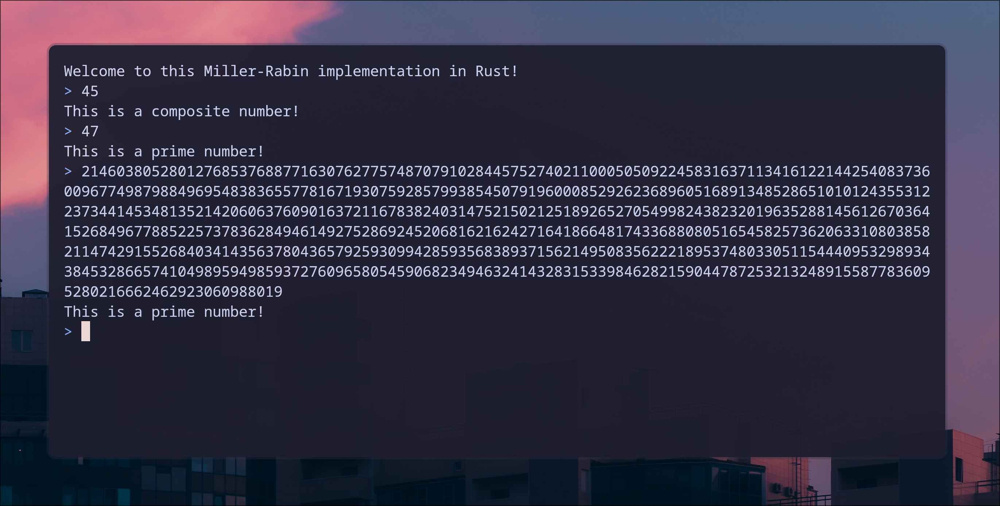

# A Miller-Rabin implementation in Rust



## Building

```console
git clone https://github.com/skilo-sh/Miller-Rabin_in_rust
cd Miller-Rabin_in_rust
cargo build
```

## Usage

You just need to do a `cargo run` then you can enter the number to test.
